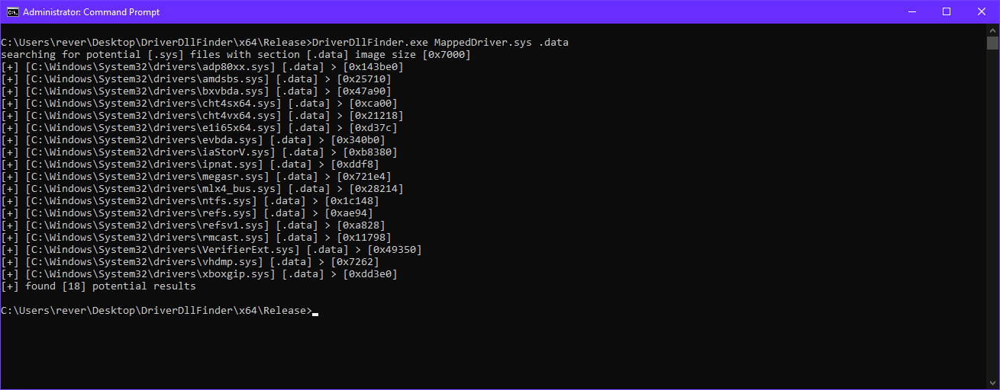

# DriverDllFInder
search for a driver/dll module that has a wanted section bigger than the size of your image

## Procedure
1. The usermode program enumeratres system32\drivers based on if the wanted file is a module/driver
2. If wanted file is a driver it checks if the enumerated driver is loaded and if it is it skips it
3. Retrieves size of wanted section of enumerated module/driver
4. Checks if size of the section is bigger than the size of image
5. Prints information about the enumerated potential module/driver



Note: this project was coded in less than an hour so it might have some bugs and the code is a mess

## Usage
```driverdllfinder.exe driver.sys/module.dll .section_name```
